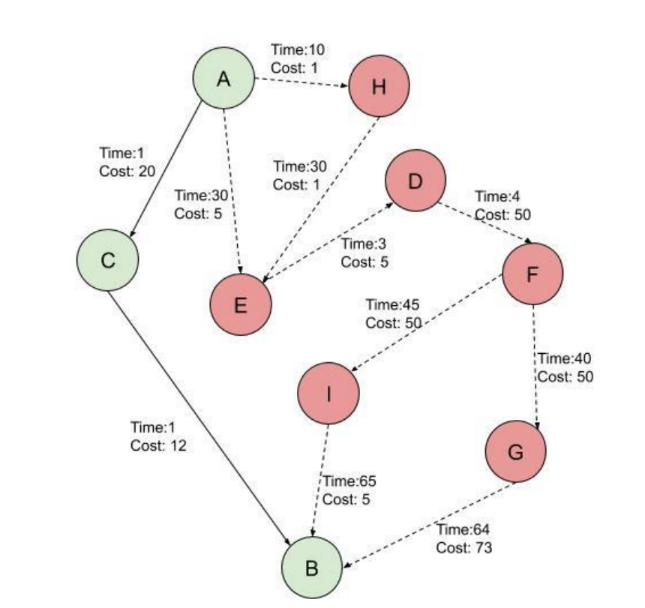
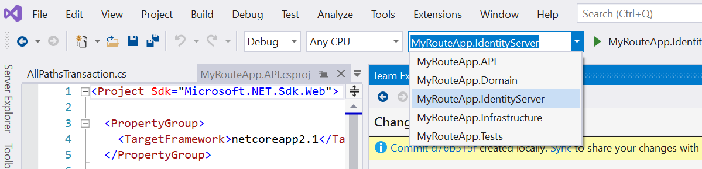
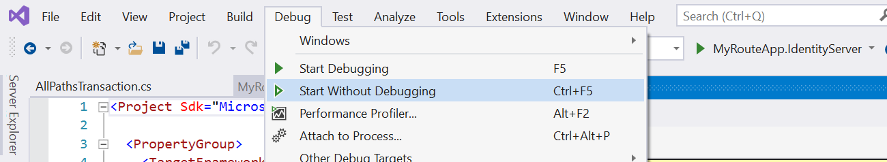
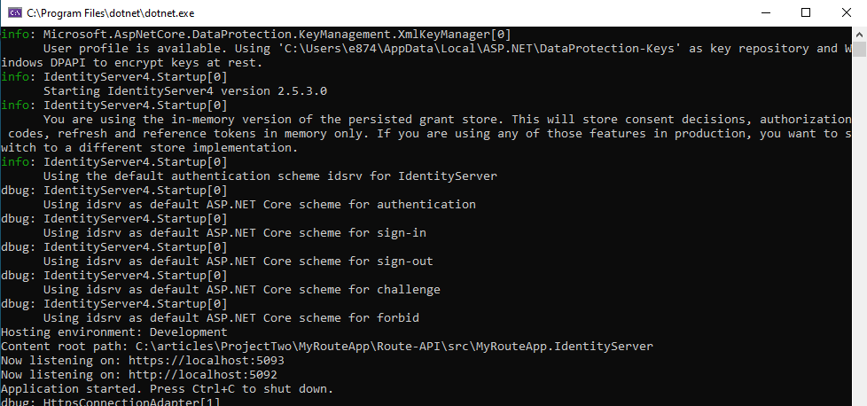
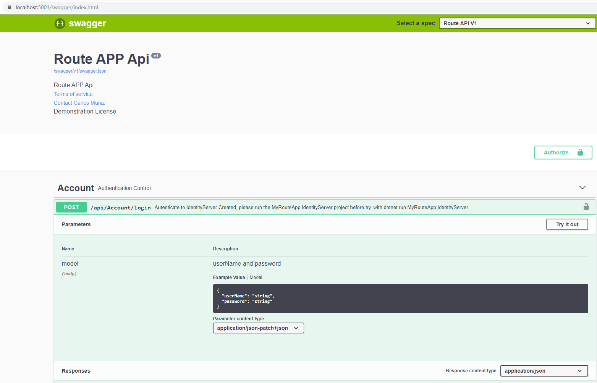
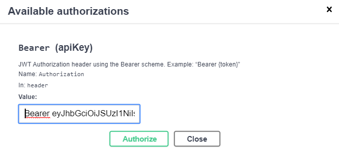
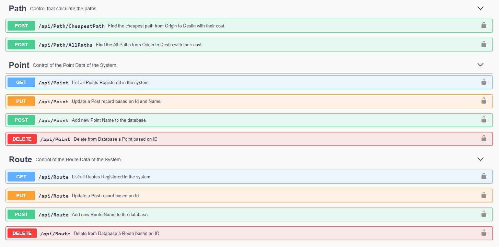

# Route API
 
Based on this graph, I've created an API to get the cheapest path (based on the cost of each route) and all paths.  Also this API has offer the possibility to modify the structure of the routes as you prefer.




# Stack Components

In this solution I've used:

Identity Server - To control the applications and users of my environment.

Jwt Bearer - To control my users in the API

SQLite - To persist the routes and points of my graph.

Entity Framework Core - The ORM to manipulate my data.

Mediatr - To organize my service in Querys and Commands.  Although I'm using only Entity Framework, would be nicer to have the queries running using Dapper, maybe in a second version ;-)

MsTest - To define some unit test from Domain and Integration Test to Validate 

Swagger - To documentation and execution of the API

# How to run the project

Running from Visual Studio, you should first build the solution, select the project MyRouteApp.IdentityServer 



and then run it without debug



The result will be our Identity Server is Online. 



You can confirm it with the URL: https://localhost:5093/.well-known/openid-configuration

you can also go to the src\MyRouteApp.IdentityServer by command line and execute the commands:
```
dotnet restore 
dotnet run
```


With the Identity Server running we can run our API.  

using Visual Studio the result will probably open the browser with the swagger Ui.  

You first action must be run the authentication method.  There are two users:

```
admin - with the password 1234 
user - with the password 1234
```
the "admin"  can alter points and routes the "user" can see the points and routes and calculate the paths.




After autentication a Token is generated and you should add it in the autorization window with the prefix Bearer




# Methods

When you run the API a sqlite database is created with the same data from the graph sample.  Here are the available methods. 



